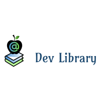

# Dev Library

A content management system library application for Software Development books. Aimed mainly towards Software Development students, Computer Science students, professional developers and instructors. A user of this app can find the technical books they need for their school, profession or just to learn. User's can signup for an account and download their books straight from the application.

## Table of contents
* [Setup](#setup)
* [Technologies](#technologies)
* [Logo](#logo)

## Setup
To run this project clone it down, navigate to the ./dev_library directory and run the following commands:<br>

Install gems:<br>
`$ bundle install`

Initialize the database and optionally seed data:<br>
```
$ rake db:migrate
$ rake db:seed
```
Run the server:<br>
`$ rails s`

For Bootstrap on the front end:<br>
`$ yarn add bootstrap jquery popper.js`

## Technologies
Project is created with:
* Ruby 2.6.1
* Rails 6.0.3
* ActiveRecord
* Bootstrap 4.5
* Sass

# Logo

	
